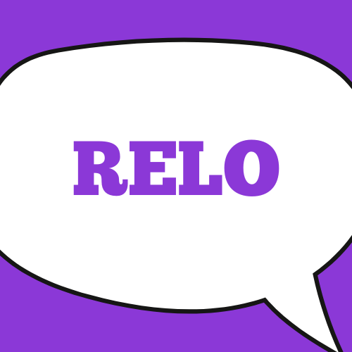

<p align="center">
  
</p>

<h1 align="center">Relo - Mạng xã hội, nhắn tin realtime, tích hợp push notifications (Flutter + Python/FastAPI)</h1>

---

## Cấu trúc dự án

- `relo/` - App mobile Flutter (Android/iOS):
  - **lib/**: code main, widget, services
  - **assets/**: hình ảnh/logo
  - **pubspec.yaml**: cấu hình package, splash, icon

### Chuẩn bị app Flutter (`relo/`)

1. Cài Flutter SDK 3.8+
2. Cài dependencies:
   ```bash
   cd relo
   flutter pub get
   ```
3. Cấu hình icon, splash:
   ```bash
   flutter pub run flutter_launcher_icons
   flutter pub run flutter_native_splash:create
   ```
4. Chạy app:
   ```bash
   flutter run
   ```

## Tuỳ chỉnh (Splash/Icon)

- **Thay logo:** thay file `assets/icons/app_logo.png` rồi chạy lại lệnh splash/icon ở trên.
- **Màu sắc splash:** đổi trong `pubspec.yaml` phần `flutter_native_splash:` (ví dụ: `#7A2FC0`).

## Tính năng nổi bật

- Đăng nhập/Đăng ký/Đổi mật khẩu với xác thực OTP
- Chat realtime, thu hồi tin nhắn, group chat
- Push notification (Firebase Cloud Messaging)
- Đăng/xem bài viết, bình luận, phản ứng
- Đa phương tiện: ảnh, video, audio, file

## Quy ước dev

- Backend: FastAPI (+ Beanie/MongoDB)
- Frontend: Flutter (provider/cubit, material UI)
- Environment: secrets config `.env` cả hai phía, KHÔNG commit lên repo công khai

## Đóng góp & Phản hồi

- Issues, PR luôn hoan nghênh!
- Feedback giao diện/tính năng bằng tiếng Việt.

---

<p align="center">
  <b>Made with love by Relo Team</b>
</p>
